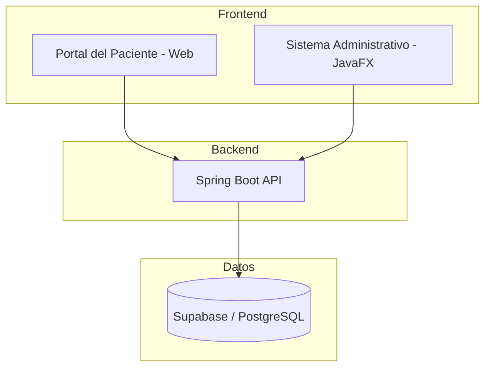

# Consultorio Dental

Sistema web de gestión para consultorio dental, diseñado bajo una arquitectura modular para escalar la gestión de pacientes, citas y tratamientos.

## 🏗️ Arquitectura del Sistema
El proyecto sigue una arquitectura **Cliente-Servidor basada en APIs REST**.


🛠️ Tecnologías
Backend: Java 21, Spring Boot, Spring Security (JWT), Spring Data JPA.

Frontend: HTML5, CSS3, JavaScript, Bootstrap.

Diseño: Figma.

Base de Datos: PostgreSQL alojado en Supabase.

Control de Versiones: Git y GitHub.

## 📂 Estructura del Proyecto
```text
DENTAL-LEON/
├── backend-api/                    # Lógica de negocio y APIs REST
├── frontend-portal-paciente/       # Interfaz orientada al paciente
├── frontend-sistema-administrativo/# Interfaz interna clínica
├── database/                       # Scripts SQL y modelos
├── docs/                           # Documentación técnica
├── figma/                          # Prototipos y activos de diseño
└── resources/                      # Archivos de soporte
```


👥 Equipo de Desarrollo
Esther: Gestión de usuarios, historial clínico, odontograma y supervisión técnica.

Josue: Backend Administrativo, Infraestructura (Supabase/Spring Boot) y Seguridad JWT.

Neyra: Diseño UI/UX y desarrollo Frontend (Portal Paciente y Administrativo).
